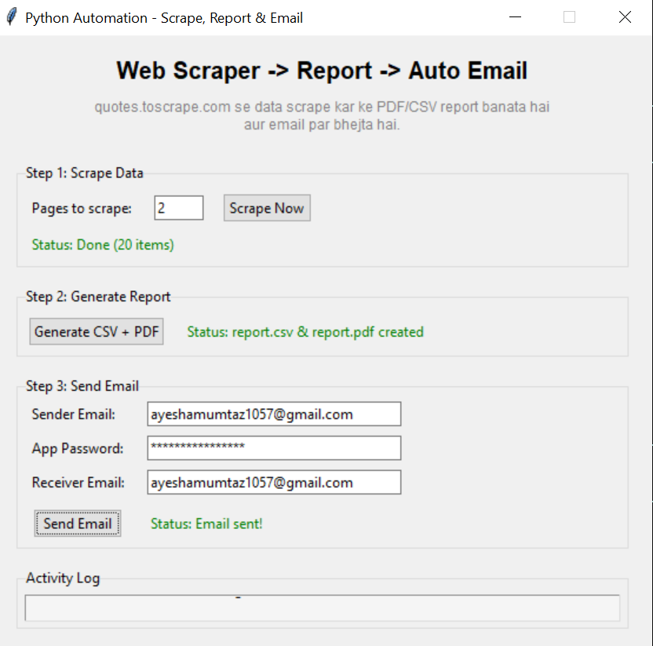
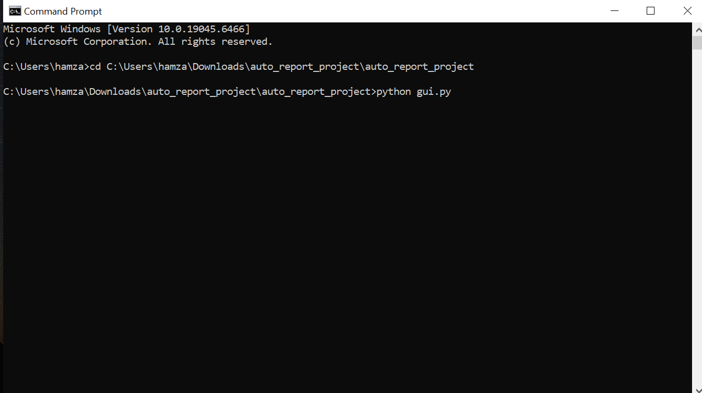
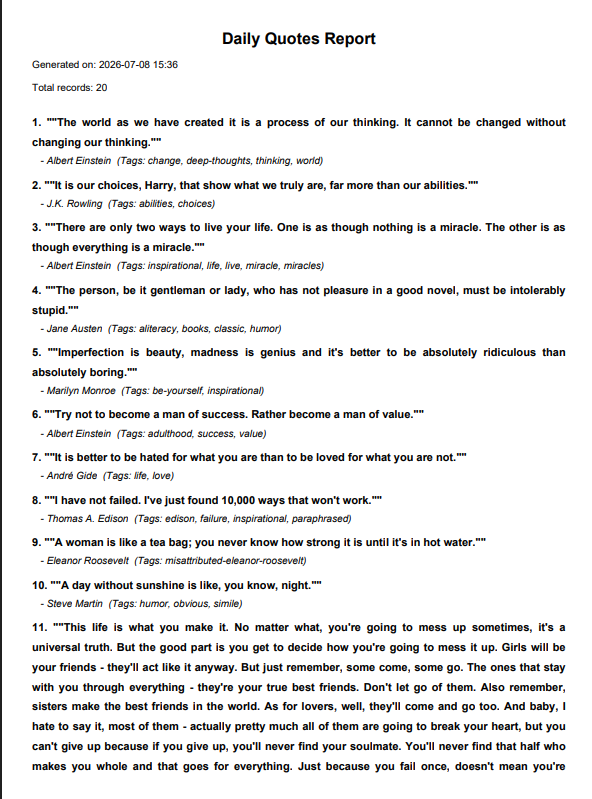

<div align="center">

# 🤖 Auto Scraper → Report → Email Automation

A Python automation pipeline that **scrapes live web data**, **generates polished PDF/CSV reports**, and **emails them automatically** — all through a clean, beginner-friendly Tkinter GUI.

[](https://www.python.org/)
[](#)
[](LICENSE)
[](https://www.crummy.com/software/BeautifulSoup/)
[](https://py-pdf.github.io/fpdf2/)
[](#)
[](#)

Built by **[Ayesha Mumtaz](https://github.com/ayeshamumtaz1057)**

[Overview](#-overview) · [Features](#-features) · [Screenshots](#-screenshots) · [How It Works](#️-how-it-works) · [Getting Started](#-getting-started) · [Troubleshooting](#-troubleshooting) · [FAQ](#-faq)

</div>

---

## 📑 Table of Contents

- [Overview](#-overview)
- [Features](#-features)
- [Screenshots](#-screenshots)
- [Tech Stack](#️-tech-stack)
- [How It Works](#️-how-it-works)
- [Project Structure](#-project-structure)
- [Getting Started](#-getting-started)
- [Usage](#️-usage)
- [Customizing for Another Website](#-customizing-for-another-website)
- [Privacy & Security](#-privacy--security)
- [Performance](#-performance)
- [Scheduling It](#-scheduling-it)
- [Troubleshooting](#-troubleshooting)
- [FAQ](#-faq)
- [Key Concepts Demonstrated](#-key-concepts-demonstrated)
- [What I Learned](#-what-i-learned)
- [Roadmap](#-roadmap)
- [Contributing](#-contributing)
- [Note on Ethical Scraping](#️-note-on-ethical-scraping)
- [Author](#-author)
- [License](#-license)

---

## 📌 Overview

This project demonstrates a real-world automation workflow used in data collection, reporting, and notification systems — the same core pattern behind tools like scheduled analytics reports, price trackers, and monitoring bots.

**The pipeline does three things automatically:**

1. **Scrape** — pulls structured data (quotes, authors, tags) from a live website
2. **Generate** — converts that data into a clean CSV file and a formatted PDF report
3. **Deliver** — emails the finished report as an attachment, no manual steps required

### The Problem

Any recurring report — a price check, a listings digest, a metrics summary — is the same three chores every time: open the site, copy the data, format it, attach it, send it. Done by hand it takes fifteen minutes and gets skipped the moment you're busy.

### The Solution

| Step | Action | Result |
|:--|:--|:--|
| 1️⃣ | **Scrape** | Structured records pulled from a live page |
| 2️⃣ | **Generate** | A `.csv` for analysis and a formatted `.pdf` for reading |
| 3️⃣ | **Deliver** | Report lands in an inbox as an attachment |

Run it as a GUI for demos, or as a single CLI command you can hand to a scheduler.

---

## ✨ Features

### Pipeline

| Feature | Description |
|:--|:--|
| **Live Web Scraping** | `requests` + `BeautifulSoup` pull structured records (quotes, authors, tags) from a live page |
| **CSV Export** | Clean, spreadsheet-ready output for further analysis |
| **PDF Report** | Formatted, printable report generated with `fpdf2` |
| **Email Delivery** | Report sent as an attachment over Gmail SMTP via `smtplib` |
| **One-Command Run** | `main.py` chains all three stages end to end |

### Interface

| Feature | Description |
|:--|:--|
| **Tkinter GUI** | Three clearly-labelled steps, no command line required |
| **Live Activity Log** | Every stage reports progress in the window as it happens |
| **Multi-Threaded** | Scraping and emailing run off the main thread — the window never freezes |
| **Step-by-Step Control** | Run one stage at a time, or the whole chain |

### System

| Feature | Description |
|:--|:--|
| **Zero API Keys** | No paid service, no signup — just an SMTP app password |
| **Modular by Design** | Scraper, report and mailer are independent files with one job each |
| **Retargetable** | Point it at any site by editing selectors in a single file |
| **Credential Safety** | `config.py` is gitignored; environment-variable pattern documented |
| **Built-Ins Preferred** | `smtplib` and `tkinter` ship with Python — only three third-party packages total |

---

## 📸 Screenshots

**GUI Interface — live pipeline with activity log**


**Running from the terminal**


**Generated PDF Report**


---

## 🛠️ Tech Stack

| Purpose | Library |
|---|---|
| HTTP requests | `requests` |
| HTML parsing | `beautifulsoup4` |
| PDF/CSV generation | `fpdf2` |
| Email delivery | `smtplib` (built-in) |
| GUI | `tkinter` (built-in) |

<details>
<summary><b>Why these choices</b> (click to expand)</summary>

<br>

| Decision | Reasoning |
|:--|:--|
| **`requests` + BeautifulSoup** over Selenium | The target page is server-rendered HTML. A browser driver would add a ~100 MB dependency, a driver-version headache and seconds of startup for data that arrives in one GET request. |
| **`fpdf2`** over ReportLab | Far smaller API surface for a fixed-layout report. ReportLab's power is wasted when the layout is a header and a table. |
| **`smtplib`** over an email API | Built into Python — no SDK, no account, no key. An app password is the only setup, and the pattern transfers to any SMTP host. |
| **Tkinter** over a web UI | Ships with Python and runs with a double-click. A Flask UI would mean a server, a browser and a port for a tool one person runs on their own machine. |
| **Threading** over async | One long blocking call per stage is exactly what a worker thread is for. `asyncio` would restructure the whole program to solve a problem this doesn't have. |
| **Separate files per stage** | The scraper can be swapped for a different site without touching the mailer, and each file can be tested on its own. |

</details>

---

## 🏗️ How It Works

```
 [ Website ]  --requests-->  [ scraper.py ]
                                    |
                                    v
                          [ report_generator.py ]
                            (creates .csv + .pdf)
                                    |
                                    v
                            [ mailer.py ]
                          (sends via Gmail SMTP)
                                    |
                                    v
                             📧 Inbox / Report
```

All three stages are wired together in `main.py` (CLI) or `gui.py` (interactive GUI).

**Why it's structured this way:** each stage takes data in and hands data out — the scraper returns records, the generator returns file paths, the mailer consumes them. Nothing reaches across a boundary, so retargeting the scraper to a new site leaves the other two files untouched.

---

## 📂 Project Structure

```
auto_report_project/
├── scraper.py            # Scrapes data from the target website
├── report_generator.py   # Builds the CSV and PDF report
├── mailer.py              # Sends the report via email
├── config.py               # Email credentials (kept out of version control)
├── main.py                 # Command-line pipeline
├── gui.py                    # Tkinter GUI version
└── requirements.txt
```

---

## 🚀 Getting Started

### Prerequisites

| Requirement | Version | Required? |
|:--|:--|:--|
| Python | 3.10+ | ✅ Yes |
| pip | latest | ✅ Yes |
| Gmail account with 2FA | — | ✅ Yes (for email delivery) |
| Internet connection | — | ✅ Yes (scraping + sending) |

### 1. Clone the repository
```bash
git clone https://github.com/ayeshamumtaz1057/python-scraping-automation.git
cd python-scraping-automation
```

### 2. Install dependencies
```bash
pip install -r requirements.txt
```

<details>
<summary>Recommended: use a virtual environment first</summary>

<br>

```bash
python -m venv venv

venv\Scripts\activate           # Windows
source venv/bin/activate        # macOS / Linux

pip install -r requirements.txt
```

Your prompt should now begin with `(venv)`.

</details>

### 3. Set up a Gmail App Password
Gmail blocks plain-password logins for security, so a dedicated App Password is required:

1. Enable **2-Step Verification**: https://myaccount.google.com/security
2. Generate an App Password: https://myaccount.google.com/apppasswords
3. Copy the 16-character code generated

### 4. Add your credentials to `config.py`
```python
SENDER_EMAIL = "your_email@gmail.com"
SENDER_APP_PASSWORD = "your_16_char_app_password"
RECEIVER_EMAIL = "receiver_email@gmail.com"
```

> ⚠️ **Security note:** Never commit real credentials. For production use, load these from environment variables instead of hardcoding them:
> ```python
> import os
> SENDER_EMAIL = os.getenv("SENDER_EMAIL")
> SENDER_APP_PASSWORD = os.getenv("SENDER_APP_PASSWORD")
> ```

---

## ▶️ Usage

**Option A — GUI (recommended for demos)**
```bash
python gui.py
```
Click through the three steps in order: **Scrape Now → Generate CSV + PDF → Send Email**, and watch progress in the live activity log.

**Option B — Command line**
```bash
python main.py
```
Runs the entire pipeline in one go: scrape → generate report → send email.

### Output files

| File | Contents |
|:--|:--|
| `report.csv` | One row per scraped record — open in Excel, Sheets or pandas |
| `report.pdf` | Formatted, printable version, sent as the email attachment |

---

## 🎯 Customizing for Another Website

To point this at a different site, edit `scraper.py`:
1. Change `BASE_URL` to the target site
2. Inspect the page (`Ctrl+Shift+I`) to find the relevant HTML tag/class names
3. Update the `BeautifulSoup` selectors accordingly

<details>
<summary>Worked example — scraping product listings instead of quotes</summary>

<br>

```python
BASE_URL = "https://books.toscrape.com/"

for card in soup.select("article.product_pod"):
    records.append({
        "title": card.h3.a["title"],
        "price": card.select_one("p.price_color").get_text(strip=True),
        "rating": card.select_one("p.star-rating")["class"][1],
    })
```

Keep the dictionary keys consistent and `report_generator.py` picks up the new columns with no changes.

</details>

---

## 🔐 Privacy & Security

| Concern | How it's handled |
|:--|:--|
| Email password | An app-specific password, revocable at any time without changing your Google password |
| Credentials in git | `config.py` belongs in `.gitignore`; the environment-variable pattern is documented above |
| Data storage | Reports are written locally only — nothing is uploaded anywhere except the email you send |
| Third-party services | None. No API keys, no accounts, no analytics |
| Transport | Gmail SMTP over TLS on port 587 |

> If you ever push a password by accident, revoke it immediately at [myaccount.google.com/apppasswords](https://myaccount.google.com/apppasswords) — rewriting git history is not enough, the credential is already exposed.

---

## ⚡ Performance

| Operation | Typical time |
|:--|:--|
| Page fetch (`requests`) | ~300–800 ms |
| HTML parsing (BeautifulSoup) | < 100 ms |
| CSV write | < 50 ms |
| PDF generation (`fpdf2`) | ~200–400 ms |
| SMTP connect + send | ~2–4 s |
| **Full pipeline** | **~3–6 s** |

The SMTP handshake dominates — which is exactly why it runs on a worker thread. Without threading the GUI would appear frozen for those few seconds every single run.

---

## ⏰ Scheduling It

The point of automation is not running it manually. Once `main.py` works, hand it to a scheduler:

<details>
<summary><b>Windows — Task Scheduler</b></summary>

<br>

1. Open **Task Scheduler** → **Create Basic Task**
2. Trigger: Daily, pick a time
3. Action: **Start a program**
4. Program: `python` · Arguments: `main.py` · Start in: your project folder

</details>

<details>
<summary><b>macOS / Linux — cron</b></summary>

<br>

```bash
crontab -e
```

```cron
# Every weekday at 9:00 AM
0 9 * * 1-5 cd /path/to/python-scraping-automation && /usr/bin/python3 main.py
```

Use absolute paths — cron does not inherit your shell environment.

</details>

---

## 🛠 Troubleshooting

<details open>
<summary><b>Setup</b></summary>

| Error | Fix |
|:--|:--|
| `'python' is not recognized` | Reinstall Python and tick **Add Python to PATH**, or use `py` on Windows |
| `ModuleNotFoundError: No module named 'bs4'` | Dependencies not installed, or the virtual environment isn't active. Run `pip install -r requirements.txt` |
| `ModuleNotFoundError: No module named 'tkinter'` | On Linux, Tkinter is a separate package: `sudo apt install python3-tk` |
| `No module named 'fpdf'` | Install `fpdf2`, not the abandoned `fpdf` — `pip install fpdf2` |

</details>

<details>
<summary><b>Scraping</b></summary>

| Error | Fix |
|:--|:--|
| Empty results, no error | The selectors don't match. Re-inspect the page — class names change |
| `ConnectionError` / `Max retries exceeded` | No internet, or the site is down. Test the URL in a browser first |
| `403 Forbidden` | The site blocks non-browser requests. Set a `User-Agent` header — and check their Terms of Service before going further |
| Only the first page is scraped | Pagination isn't implemented yet — see [Roadmap](#-roadmap) |

</details>

<details>
<summary><b>Report generation</b></summary>

| Error | Fix |
|:--|:--|
| `UnicodeEncodeError` in the PDF | `fpdf2`'s default font is Latin-1 only. Register a Unicode TTF, or strip non-ASCII characters before writing |
| `PermissionError: report.csv` | The file is open in Excel. Close it and re-run |
| PDF text runs off the page | Long strings need wrapping — use `multi_cell` instead of `cell` |

</details>

<details>
<summary><b>Email delivery</b></summary>

| Error | Fix |
|:--|:--|
| `SMTPAuthenticationError (535)` | Using your real Gmail password. You need a 16-character **App Password** |
| `Username and Password not accepted` | App Password pasted with spaces, or 2-Step Verification isn't enabled on the account |
| Email sends but no attachment | The report file didn't exist when the mailer ran — run the generate step first |
| `SMTPServerDisconnected` | Network dropped mid-send, or a firewall is blocking port 587 |
| Mail lands in spam | Expected for automated mail from a personal account. Mark it "not spam" once |

</details>

<details>
<summary><b>GUI</b></summary>

| Error | Fix |
|:--|:--|
| Window freezes during a step | That stage isn't running on a worker thread — every long call must be wrapped in `threading.Thread` |
| `RuntimeError: main thread is not in main loop` | A worker thread touched a widget directly. Queue the update back to the main thread instead |
| Buttons do nothing | Check the activity log — the exception is usually being swallowed inside the thread |

</details>

<details>
<summary><b>Git & GitHub</b></summary>

| Error | Fix |
|:--|:--|
| `! [rejected] main -> main (fetch first)` | Remote has commits you don't. `git pull --rebase origin main`, then push |
| `Support for password authentication was removed` | Use a Personal Access Token: Settings → Developer settings → Tokens (classic) → scope `repo` |
| Credentials accidentally committed | Revoke the app password **first**, then remove the file and add it to `.gitignore` |

</details>

---

## ❓ FAQ

<details>
<summary><b>Do I need to pay for anything?</b></summary>
<br>
No. Every dependency is free and open source, and Gmail SMTP is free with any Google account. The only setup cost is generating an app password.
</details>

<details>
<summary><b>Is scraping this site legal?</b></summary>
<br>
<code>quotes.toscrape.com</code> exists specifically for scraping practice, so yes. For any other site, read their <code>robots.txt</code> and Terms of Service before you point this at it — see the ethics note below.
</details>

<details>
<summary><b>Why an App Password instead of my normal password?</b></summary>
<br>
Google stopped accepting plain passwords from third-party apps in 2022. App passwords are also safer: each one is scoped and individually revocable, so leaking it doesn't compromise your account.
</details>

<details>
<summary><b>Can I use Outlook or another provider?</b></summary>
<br>
Yes — change the SMTP host and port in <code>mailer.py</code>. Outlook uses <code>smtp-mail.outlook.com:587</code>, Yahoo uses <code>smtp.mail.yahoo.com:587</code>. The rest of the code is provider-agnostic.
</details>

<details>
<summary><b>Can it send to multiple recipients?</b></summary>
<br>
Yes — make <code>RECEIVER_EMAIL</code> a list and pass it to <code>sendmail()</code>, joining the addresses with commas for the <code>To</code> header.
</details>

<details>
<summary><b>Does it work on macOS and Linux?</b></summary>
<br>
Yes. On some Linux distributions Tkinter is packaged separately — <code>sudo apt install python3-tk</code>.
</details>

<details>
<summary><b>Can I run it on a schedule?</b></summary>
<br>
Yes, that's the intended use. See <a href="#-scheduling-it">Scheduling It</a> for Task Scheduler and cron setups.
</details>

<details>
<summary><b>Why does the GUI need threading at all?</b></summary>
<br>
Tkinter runs a single event loop. A blocking network call inside a button handler stops that loop, so the window stops redrawing and the OS marks it "Not Responding". Moving the work to a thread keeps the loop free to draw the activity log while the work happens.
</details>

---

## 📚 Key Concepts Demonstrated

- Web scraping & HTML parsing
- File I/O and structured data export (CSV/PDF)
- SMTP email automation
- GUI development with threading (non-blocking UI)
- Clean separation of concerns (scraper / report / mailer / interface)

---

## 📖 What I Learned

**A frozen window looks broken, even when it isn't.** The first version ran everything in the button handler. It worked perfectly and still felt broken — the window greyed out for four seconds and Windows labelled it "Not Responding". Moving the work to a worker thread changed nothing about the output and everything about whether the tool felt usable.

**Threads can't touch widgets.** The obvious fix — updating the log label from inside the thread — crashed intermittently rather than consistently, which is the worst kind of bug. Tkinter is single-threaded by design; updates have to be queued back to the main loop.

**Encoding shows up at the worst possible time.** Everything worked until a quote contained a curly apostrophe, and `fpdf2` threw a `UnicodeEncodeError` at the final step of a pipeline that had already done all its real work. Text encoding is not an edge case when your input is arbitrary web content.

**Credentials belong outside the code from day one.** Putting them in `config.py` and gitignoring it took two minutes. Discovering a password in a public repo's history costs far more than that.

**Separate files pay for themselves immediately.** Retargeting the scraper to a different site meant editing exactly one file. If parsing, formatting and sending had lived in one script, that same change would have meant re-reading all of it.

---

## 🗺 Roadmap

- [ ] Multi-page scraping with pagination support
- [ ] Load credentials from `.env` via `python-dotenv` instead of `config.py`
- [ ] Retry with exponential backoff on failed requests
- [ ] Scheduling built into the GUI (daily / weekly) instead of relying on cron
- [ ] Excel (`.xlsx`) export alongside CSV
- [ ] Charts embedded in the PDF report
- [ ] Multiple recipients and a configurable email template
- [ ] Config file for selectors, so retargeting needs no code edits
- [ ] Logging to file for unattended scheduled runs
- [ ] Unit tests with mocked HTTP responses
- [ ] Docker image for one-command deployment

---

## 🤝 Contributing

Contributions are welcome.

```bash
git checkout -b feature/your-feature
git commit -m "Add your feature"
git push origin feature/your-feature
```

Please keep each stage in its own module (scraper / generator / mailer), never commit real credentials, and test any new selector logic against a live page before opening a PR.

---

## ⚖️ Note on Ethical Scraping

This project scrapes [quotes.toscrape.com](https://quotes.toscrape.com), a site built specifically for scraping practice. When adapting this for real-world websites, always check their `robots.txt` and Terms of Service before scraping.

**A short checklist before pointing this at any real site:**

- ✅ Read `robots.txt` (`https://example.com/robots.txt`) and honour it
- ✅ Read the Terms of Service — some prohibit automated access outright
- ✅ Add a delay between requests; don't hammer a server you don't own
- ✅ Identify yourself with a real `User-Agent` rather than pretending to be a browser
- ✅ Prefer an official API where one exists
- ❌ Never scrape personal data, or anything behind a login

---

## 👩‍💻 Author

**Ayesha Mumtaz**

[](https://github.com/ayeshamumtaz1057)

---

## 📄 License

This project is open-sourced for educational purposes under the MIT License.

<div align="center">

⭐ **Star this repo if you found it useful**

</div>
